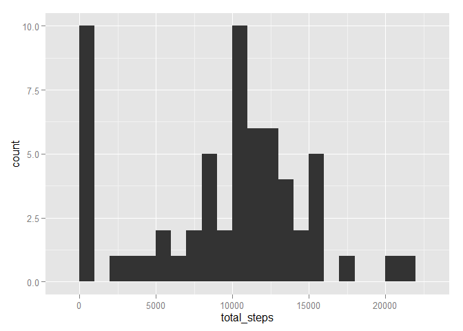
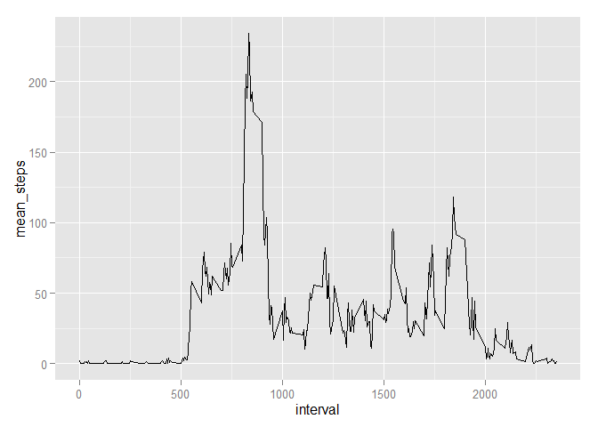
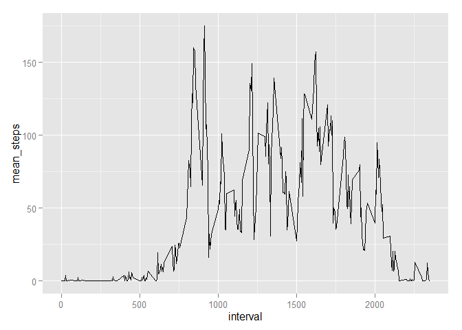

# Reproducible Research: Peer Assessment 1

#### Loading and preprocessing the data
This is the analysis of the step count data set supplied for the coding assignment 1 for the Reproducible Research course as part of the Data Science sertification. 


```r
library(ggplot2)
library(data.table)
steps <- read.csv("C://classes/DSCert/R/data/activity.csv")
steps$dow <- strftime(as.POSIXlt(steps$date),'%A')
steps.dt <- data.table(steps)
steps.weekday <- steps.dt[!(dow == "Sunday" | dow == "Saturday")]
steps.weekend <- steps.dt[dow == "Sunday" | dow == "Saturday"]
steps.byinterval <- steps.dt[,.(mean_steps = mean(steps, na.rm = TRUE)), by=interval]
steps.bydate <- steps.dt[,.(total_steps = sum(steps, na.rm = TRUE)), by=date]
steps.weekend.byinterval <- steps.weekend[,.(mean_steps = mean(steps, na.rm = TRUE)), by=interval]
steps.weekday.byinterval <- steps.weekday[,.(mean_steps = mean(steps, na.rm = TRUE)), by=interval]
```

#### What is mean total number of steps taken per day?
The avearge number of steps taken per day is 9354. The median number of steps taken per day is 10395. The histogram below shows frequency distribution of steps per day. 


```r
qplot(total_steps , data = steps.bydate, geom = "histogram", binwidth = 1000)
```

 

#### What is the average daily activity pattern?
We use the number of steps per intervial calculated earlier in the script to plot activity patterns:


```r
qplot(interval, mean_steps, data = steps.byinterval, geom = "line")
```

 


#### Imputing missing values
Initial review of the data set shows that missing data reading only appear for the entire day at a time. Moreover, the data is missing for 2 weekend days and for 6 weekday days, which is approximately weekend/weekday ratio in teh entire data set. So adding average value across multiple days will not affect the conclusion so it's not necessary. 


#### Are there differences in activity patterns between weekdays and weekends?
We are using previously calcualted data subsets steps.weekend.byinterval and steps.weekday.byinterval to compare activity patterns. We see that patterns are different with activity more speread throughout teh day on weekend (lower chart) and more concentrated in the morning and in teh evening on weekdays (upper chart)

```r
qplot(interval, mean_steps, data = steps.weekday.byinterval, geom = "line")
```

 

```r
qplot(interval, mean_steps, data = steps.weekend.byinterval, geom = "line")
```

 
